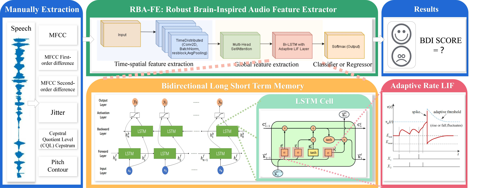
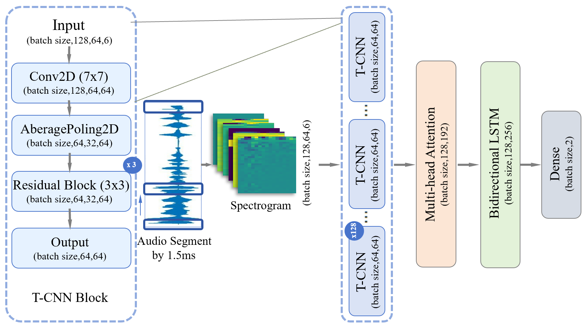
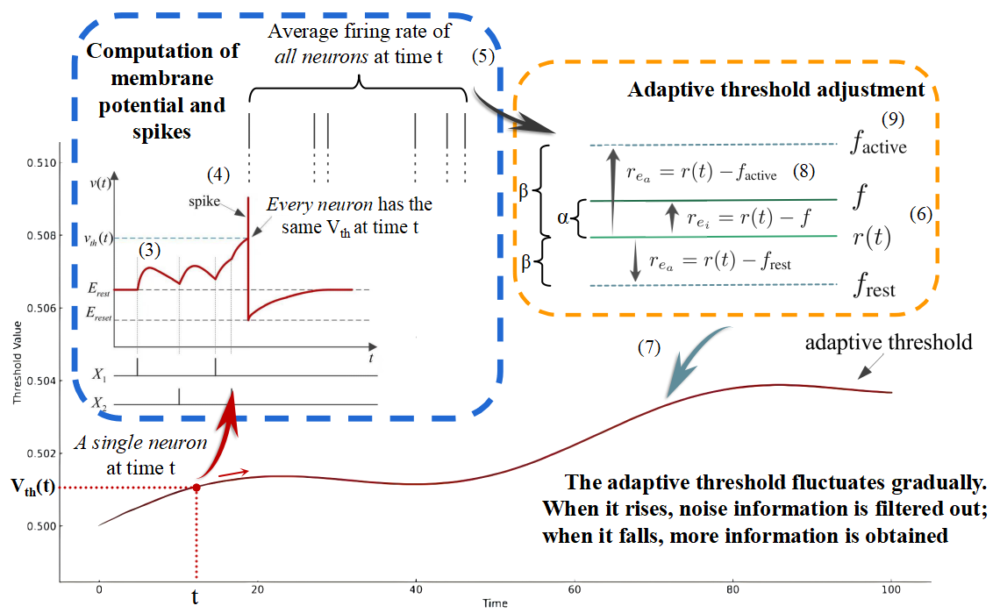
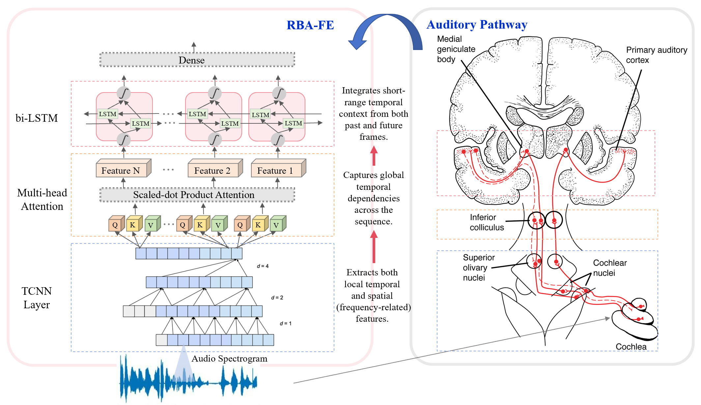

# RBA-FE: Robust Brain-Inspired Audio Feature Extractor for Depression Diagnosis

[](https://www.python.org/downloads/) [](https://www.tensorflow.org/) [](https://opensource.org/licenses/MIT)


Paper link: [https://arxiv.org/abs/2506.07118](https://arxiv.org/abs/2506.07118)

## 📋 Overview

RBA-FE is a robust brain-inspired audio feature extractor for depression diagnosis that leverages an improved hierarchical network architecture mimicking the human auditory pathway. The model introduces ARSLIF (Adaptive Rate Smooth Leaky Integrate-and-Fire) neurons to handle environmental noise challenges in audio-based depression detection.

## 🏗️ Architecture

### Overall System Architecture

<div align="center">
  
  <br>
  <em>Figure 1: Complete RBA-FE system architecture with manual feature extraction, hierarchical processing, and ARSLIF neurons</em>
</div>

#### Detailed Architecture Components
<details>
<summary><b>📊 Click to view detailed architecture diagrams</b></summary>
<table>
<tr>
<td width="50%">
Data Flow Pipeline

<em>Figure 2: Data flow and tensor dimensions</em>
</td>
<td width="50%">
ARSLIF Neuron Model

<em>Figure 4: Adaptive Rate Smooth LIF dynamics</em>
</td>
</tr>
<tr>
<td colspan="2">
Brain-Inspired Hierarchical Architecture
<div align="center">

<br>
<em>Figure 3: Hierarchical network inspired by human auditory pathway</em>
</div>
</td>
</tr>
</table>
</details>

#### ARSLIF Innovation
The ARSLIF model enhances standard LIF neurons through:
- **Adaptive Threshold**: Dynamically adjusts based on firing rates (equations 6-9)
- **Smooth Gradient**: Ensures stable backpropagation during training
- **Noise Robustness**: Filters environmental noise through selective firing
- **Dual Error Control**: Balances target rate (α) and adaptive rate (β) errors

## 🚀 Quick Start

### Installation
```bash
# 1. Clone the repository
git clone https://github.com/yourusername/RBA-FE.git
cd RBA-FE

# Create virtual environment
conda create -n rbafe python=3.8
conda activate rbafe

# Create virtual environment
conda create -n rbafe python=3.8
conda activate rbafe

# Install dependencies
pip install -r requirements.txt
```
### Train

```bash
# Train on AVEC2014
python train_and_evaluate.py \
    --dataset AVEC2014 \
    --data_dir data/AVEC2014 \
    --batch_size 96 \
    --epochs 20 \
    --learning_rate 0.0005

# Train on MODMA
python train_and_evaluate.py \
    --dataset MODMA \
    --data_dir data/MODMA \
    --batch_size 96 \
    --epochs 20 \
    --learning_rate 0.001

# Train on DAIC-WOZ
python train_and_evaluate.py \
    --dataset DAIC-WOZ \
    --data_dir data/DAIC-WOZ \
    --batch_size 96 \
    --epochs 20 \
    --learning_rate 0.001
```


## 📁 Project Structure

```
RBA-FE/
├── dataProcessor/              # Data loading and preprocessing
│   ├── __init__.py
│   └── data_loader.py         # Audio data loading with feature extraction
├── featureExtractor/          # Feature extraction utilities
│   ├── __init__.py
│   └── feature_extractor.py  # MFCC, Pitch, Jitter, CQT extraction
├── models/                    # Model architectures
│   ├── __init__.py
│   ├── arslif_layers.py     # ARSLIF neuron implementation
│   └── model_definition.py  # RBA-FE model architecture
├── scripts/                  # Training and evaluation scripts
│   ├── train_and_evaluate.py
├── requirements.txt        # Dependencies
├── config.yaml            # Configuration file
└── README.md
```

## 🔬 Technical Details

###  Acoustic Features

The model extracts 6 key acoustic features:

1. **MFCC**: Mel-frequency cepstral coefficients (40 coefficients)
2. **MFCC Delta**: First-order derivatives of MFCC
3. **MFCC Delta2**: Second-order derivatives of MFCC
4. **Pitch**: Fundamental frequency and RMS energy
5. **Jitter**: Vocal frequency irregularities
6. **CQT**: Constant-Q transform for harmonic analysis

### ARSLIF Mathematical Model

The ARSLIF neuron dynamics:

```
dV_m/dt = -(V_m - R*I)/τ_mem
V_th_new = V_th + (dt/τ_adapt) * r_e
r_e = α*(r - f) + β*(r - f_adapt)
```

Where:
- `V_m`: Membrane potential
- `V_th`: Adaptive threshold
- `r`: Firing rate
- `f`: Target firing rate
- `f_adapt`: Adaptive target rate

### Noise Robustness

The model maintains performance under various noise conditions:
- Pink noise: Traffic and electrical appliances
- Blue/Purple noise: Human voices and high-frequency sounds
- SNR range: -20dB to +20dB

## 📝 Citation

If you use this code in your research, please cite our paper:

```bibtex
@article{rbafe2024,
  title={RBA-FE: A Robust Brain-Inspired Audio Feature Extractor for Depression Diagnosis},
  author={Your Name et al.},
  journal={arXiv preprint arXiv:2406.07118},
  year={2024},
  url={https://arxiv.org/abs/2406.07118}
}
```

This project is licensed under the MIT License - see the [LICENSE](LICENSE) file for details.
